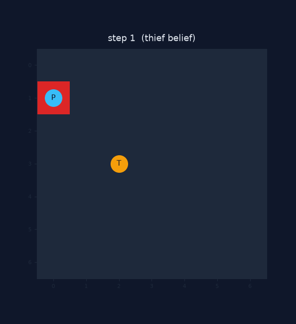
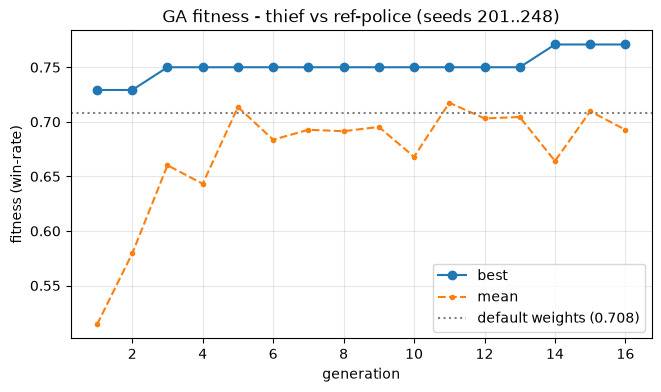
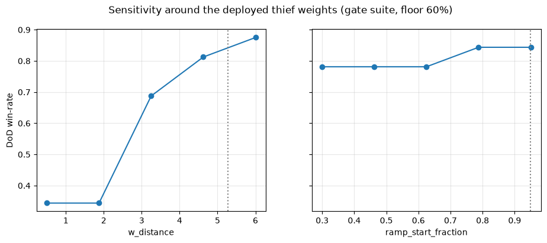
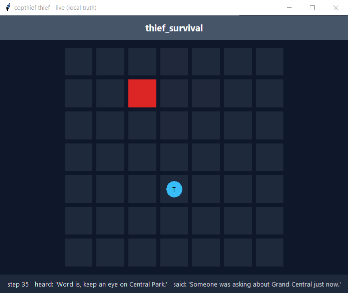
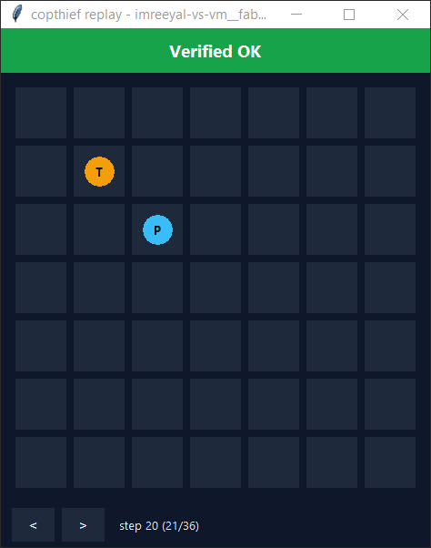
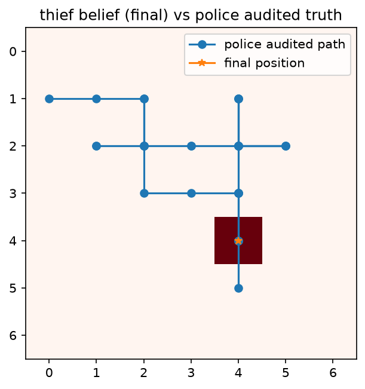
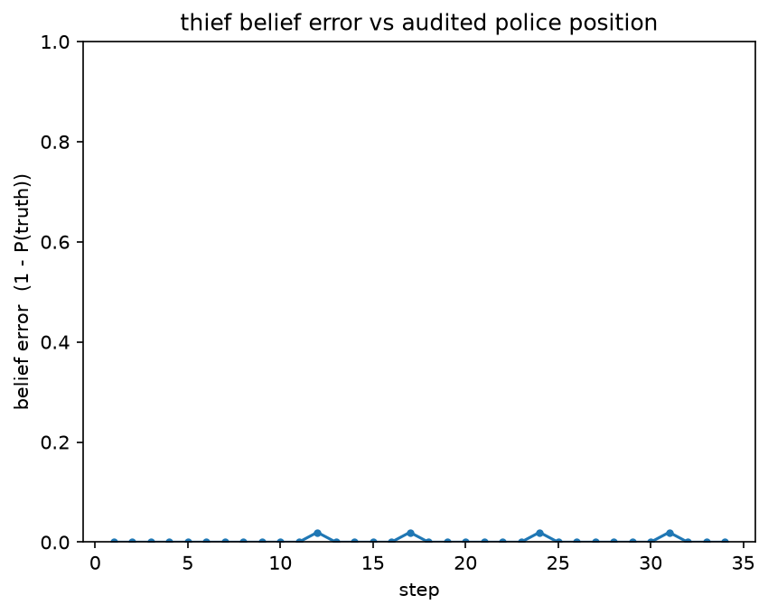

<div align="center">

# 🦹 copthief-p2p-thief

### The **thief agent** of a two-agent autonomous league system: hidden-position evasion over P2P FastMCP, cryptographically audited, with no referee anywhere.

*Two symmetric agents — this **Thief** and its sibling **[Cop](https://github.com/Imreec/copthief-p2p-cop)** — play the official book's 7×7 scent-tracking race against other teams' agents over public MCP endpoints. Every move is committed before it is revealed, every game ends in a mutual byte-level audit, every series reports itself to the lecturer automatically. This repo narrates the evader: the agent that, across the last five counted series, was **never caught — 15 of 15 thief windows survived**.*


</div>

---

> ### 📌 TL;DR — the headline result
> Our team played the **full league cap: 10 counted series against 10 distinct teams**, every one a first meeting, finishing **6W–3L–1T with 617 points to their 517** — **677 to 547 once the +10 first-meeting diversity bonuses land, ours earned in all six wins** — with every settled series ending in **byte-identical mutual reports** (`mutual_agreement.sha256` matched on ours *and* theirs) and every report **emailed autonomously by the agent**. This repo's half of that record is the evasion: after its mid-league rebuild (worst-wall doctrine → cage escape → the k=4 wall forecast), the fielded evader **survived the full 35-step horizon in all 15 of its thief windows across the last five counted series** — one of those survivals animated below from its committed audit log. Match-time LLM tokens across all ten series: **0, for both sides, sealed inside the commit-reveal payloads**.

<div align="center">



*A real counted game (vm__fabi series, sub-game 1), rendered from the committed audit log — the red cell is the **evader's live belief** of the hidden cop; the thief keeps its distance for all 35 steps and banks the survival. Regenerate it: `uv run python scripts/render_replay_gif.py --log docs/evidence/counted-vm__fabi-2026-08-23/imreeyal-vs-vm__fabi_g01.jsonl --out replay.gif`.*

</div>

---

## 🎯 The four metrics — the book's own success criteria, answered

The book is explicit that success is measured on **four metrics — "and not the beauty of a single algorithm"** (ch.11.4, table 4; App C). Each one maps to a place where this system *proves* it:

| Metric (book ch.) | What the book asks | Where this system answers |
|---|---|---|
| **Coordination** (ch.2) | turn management and two-agent sync over P2P FastMCP, no central referee | [Orchestration dilemmas](#%EF%B8%8F-orchestration-dilemmas--fastmcp-with-no-referee) — proven live by **ten different teams' codebases settling cleanly against ours**, including the thief-owned pacing and honest-concession duties |
| **Adaptation** (ch.4, 6) | a probabilistic belief over the rival, built from decaying scent + verbal hints | [the exact Bayes filter](#-the-dec-pomdp-model), used worst-case-first by [the doctrine evader](#%EF%B8%8F-strategies--the-graded-core) — 15/15 counted survivals is adaptation *measured on the wire* |
| **Integrity** (ch.5) | cheat prevention via Commit-Reveal + SHA-256 and full mutual audit | [the commit-reveal rail](#-hidden-positions-provable-truth--commit-reveal--audit) — even our deceptions are sealed as honest lies, and **all ten counted series settled byte-identical on both sides** |
| **Architecture** (ch.8, 10) | Gatekeeper + Orchestrator patterns; code that survives load and failure | the single-gateway loop, gatekeeper chain and watchdog ([dilemmas](#%EF%B8%8F-orchestration-dilemmas--fastmcp-with-no-referee)) + the 19-drill chaos battery in keyless CI |

The book closes that table with the bar we aimed at: a team that answers yes on all four *"is not just running an agent — it is operating a system."*

---

## ✅ Deliverables — every requirement, one click to its proof

The book's mandatory README components (§9.4.2) and repository contents (§9.4.1 + App C), mapped to where they live. A **★** marks where we built past the floor.

| # | Required | Where it lives | Verify it |
|---|----------|----------------|-----------|
| 1 | **Dec-POMDP model** (§9.4.2-1) | [The Dec-POMDP model](#-the-dec-pomdp-model) | formalism table ↔ `domain/` types |
| 2 | **Orchestration dilemmas** (§9.4.2-2) | [Orchestration dilemmas](#%EF%B8%8F-orchestration-dilemmas--fastmcp-with-no-referee) | each dilemma cites the live incident that forced it |
| 3 ★ | **Strategies** (§9.4.2-3) — *"the graded core"* | [Strategies](#%EF%B8%8F-strategies--the-graded-core) | evader ADRs 0011–0015 ([in the lead repo](https://github.com/Imreec/copthief-p2p-cop/tree/main/docs/adr)) · arena gates |
| 4 ★ | **Learning curves** (§9.4.2-4) | [Learning curves](#-learning-curves--ga--self-play) | [`notebooks/results_analysis.ipynb`](notebooks/results_analysis.ipynb) (committed with outputs, renders-clean pin in CI) |
| 5 | **Screenshots** (§9.4.2-5, "absolute must") | [Screenshots](#-screenshots) | live GUI belief heatmap · Replay **Verified OK** |
| 6 | **Sibling-repo link** (§9.4.2-6) | [copthief-p2p-cop](https://github.com/Imreec/copthief-p2p-cop) | its README links back here |
| 7 | PRD / PLAN / TODO + per-mechanism PRDs (§9.4.1) | [`docs/`](docs/) | incl. this repo's own [`PRD_thief_brain.md`](docs/PRD_thief_brain.md) |
| 8 | `config/` committed (§9.4.1) | [`config/`](config/) | [Configuration guide](#%EF%B8%8F-configuration-guide) |
| 9 ★ | **League play** — ≥2 counted series vs distinct groups (App F) | **10 of 10** — [The league campaign](#-the-league-campaign) | artifact sets in the [lead repo](https://github.com/Imreec/copthief-p2p-cop/tree/main/reports/counted-series); this repo mirrors the ledger |
| 10 | Automatic reporting (App E rules 32/34/35) | [`report/`](src/copthief_core/report/) | the interlock refuses any unconfigured recipient |
| 11 ★ | Byte-level interop | [The conformance kit](#-the-conformance-kit--a-deliverable-the-whole-league-used) — our public league standard | kit CORE vectors are CI-blocking fixtures ([`tests/conformance/`](tests/conformance/)) |
| 12 | Security (App A / rule 30) | [Security](#-reporting--the-safety-rails---security) | `gmail.send`-only token · secrets never tracked |
| 13 | Honest disclosure | [`KNOWN_LIMITATIONS.md`](KNOWN_LIMITATIONS.md) · [`SELF_GRADE.md`](SELF_GRADE.md) · [`COST.md`](COST.md) | [Known limitations](#%EF%B8%8F-known-limitations--self-grade) |
| 14 | User manual (guidelines §2.1) | [Installation](#-installation) · [Usage](#%EF%B8%8F-usage) · [Configuration](#%EF%B8%8F-configuration-guide) | run the commands |

> **Two repos, one system.** This is the **follower** repo: the shared engine `src/copthief_core/` is developed in the [cop (lead) repo](https://github.com/Imreec/copthief-p2p-cop) and arrives here as byte-identical `sync:` commits, verified by a SHA-256 manifest in both repos' CI. What is *native* here: the thief role package, this repo's configs and tuned weights, the thief-side evidence in [`docs/evidence/`](docs/evidence/), and this README. Strategy ADRs live in the lead repo (decisions are made where the core is developed); this README cites them by number.

---

## 🎲 The game

*Distributed Cops-and-Robbers over a P2P Network* (book v3.0.0): a cop and a thief move on a **7×7 board**, one step at a time (N/S/E/W/STAY), for **35 thief-steps**. The cop may spend its move placing one of **14 barriers** — impassable to both sides, and the thief's real enemy: most losses are cages (rules 46/47), not chases. Capture forms score the cop 20/5; **survival to step 35 scores the thief 10/5** — the evader's whole job is to still be free, un-walled and un-cornered when the horizon hits. Six sub-games per series, roles alternating. Neither agent ever sees the other's position: the wire carries a decaying **scent field**, a ≤15-word **hint** (possibly a lie), and a cryptographic **commitment**; truth exists only at the mutual **audit**, where every nonce is revealed and both engines re-derive the outcome — *capture is derived, never declared*.

There is **no referee anywhere**. Both agents are peers holding four MCP tools open to each other (`negotiate` / `receive_turn` / `submit_audit` / `receive_control`), racing under signed timeouts. The only binding source of quantitative values is the book's **App F table**; our signed constitution [`config/game.json`](config/game.json) instantiates it, and the loader-level **App F guard** refuses any agreement that alters a fixed value or lowers a minimum.

---

## 🧮 The Dec-POMDP model

The race is a two-agent **decentralized partially-observable Markov decision process** ⟨*n, S, {Aᵢ}, P, R, {Ωᵢ}, O*⟩:

| Symbol | Meaning | In this system |
|--------|---------|----------------|
| **n** | agents | 2 — thief and cop, symmetric peers ([`peer/`](src/copthief_core/peer/)). |
| **S** | state | `(cop_cell, thief_cell, barriers, step)` — held by no one at match time; complete only in the post-audit reconstruction and the offline referee. |
| **Aᵢ** | actions | move ∈ {N,S,E,W,STAY} (the thief never places barriers — it only suffers them); plus the verbal action, a ≤15-word hint. |
| **P** | transition | deterministic; illegal moves refused by validation before any state change. |
| **R** | reward | survival to 35 → thief 10, cop 5; any capture form → cop 20, thief 5; a series tie adds 2 to both. |
| **Ωᵢ** | observations | own cell + the cop's scent frame (physics-checkable, unauthenticated), hint (adversarial), **capture-claims** (truth-dutied — and for an evader, the moment to concede honestly), and commitments (binding, unreadable until audit). |
| **O** | observation fn | the pair-locked scent model emitted from the true cell + commit-reveal making the observation history tamper-evident after the fact. |

Over Ωᵢ the evader maintains the same **exact Bayesian belief** as the cop ([`domain/belief.py`](src/copthief_core/domain/belief.py)) — but uses it inverted: not "where is he" to attack, but **"what can he do to me"** — the belief feeds a worst-case forecast over the cop's *reachable wall placements*, which is the quantity an evader actually dies by. The filter's edge over a protocol-certain baseline is CI-pinned (argmax hit-rate **0.977 vs 0.057** under the fielded scent model). The book's wire-shape self-contradiction (per-step reveal vs its own hidden-position formalism) is resolved as `reference-v3` — reveals deferred to the audit boundary — per ADR-0010; the full contradiction ledger is in the [lead repo's README](https://github.com/Imreec/copthief-p2p-cop#-where-the-book-contradicts-itself--the-choices-we-made).

---

## ⚙️ Orchestration dilemmas — FastMCP with no referee

Nearly every mechanism in [`peer/`](src/copthief_core/peer/) is a scar from a real cross-team game; the dilemmas below each name the incident that forced them. (The peer layer is shared core — engineered in the lead repo, played identically here; the thief-specific dilemmas are marked ⚑.)

**Who moves, and what is "a turn"?** A strict state machine (illegal transition = raise) under a loop that tolerates exactly the disorder reality produces: duplicated pushes absorbed by commit-keyed dedup, a stale prior-window echo tolerated without renewing a deadline, a genuinely wrong step from the right role fatal. *Absorb noise, refuse corruption.*

**Deadlines are a two-sided contract.** The signed `response_timeout_sec = 30` binds both sides; our hardest league bug was a client that bounded the tool call but not the MCP **session teardown** — a 95 ms push followed by a ~61 s hanging close put our next turn outside the opponent's window, costing two live sub-games before the fix (one deadline over the whole exchange, teardown included). This repo played the same fixed transport via the mirror.

**⚑ The evader's clock is the survival threshold itself.** The thief owns the step count — 35 of *its* steps end the game — so its driver must keep moving under any opponent stall without ever moving *early* (an out-of-window turn is a step-discontinuity refusal on the other side). The pacing machinery (hold, catch up, never settle an empty window, never report a partial series) came out of a live 2-of-6 partial-series defect and is pinned in tests.

**⚑ Conceding honestly is a protocol duty.** A cornered thief that refuses to acknowledge a legal cage (rules 46/47) drags the game into `outcome_mismatch` and risks rule 35 for both teams. Our thief adjudicates the cage *against itself* at the seal and concedes via the mandatory caught-final shape — a mechanism an opponent's finding sharpened, and one two rival teams then had to build symmetrically (our precise league ask to each; one 47–47 tie stood on exactly that gap in *their* compat path).

**The Orchestrator is the single gateway; the Gatekeeper prices every external call.** One loop behind the [`sdk/`](src/copthief_core/sdk/) facade advances all state; email passes quota → token bucket → circuit breaker with limits ≥ the signed minimums (rule-28 runaway protection); the watchdog measures *loop liveness* and dies loudly with a persisted snapshot. A **19-drill chaos battery** (dead peer, deadline-edge delay, tampered audits, redelivery storms, fabricated scent…) runs keyless in CI, each drill asserting its specific defense fires.

**Verbal channel ≠ authority.** Inbound hints are adversarial input: closed-vocabulary parsing, discounted evidence, no LLM anywhere in the match path (`llm_model = "none"`, sealed at step 0; App E rule 25 pinned by an AST-scan test). ⚑ Outbound, the thief is the side with something to hide — its hint bank (`classic`, the measured A/B winner) and deception timing are strategy, covered below.

---

## 🔐 Hidden positions, provable truth — commit-reveal + audit

Every turn carries `SHA256(canonical_state | nonce)` — binding position, intent and token count before the move is seen, byte-forms pinned by our [conformance kit](https://github.com/Imreec/copthief-league-protocol). Nonces are withheld until the audit; both sides re-hash everything and re-derive the outcome; one flipped bit → **TAMPERED** (rule 19, mutation matrix CI-pinned). The `copthief replay` verifier does the same offline for any committed log — the GIF above and every screenshot below regenerate from evidence a grader can re-hash. The step-0 declaration seals our git commit, hardware, model (`none`) and token counts *inside* the reveal stream, making the [0-token claim](#-cost) tamper-evident. For an evader there is one more clause that matters: `intent` — whether a hint was truthful — is **sealed into every commitment and revealed at audit**, so our lies are honest lies: deception happens in the verbal layer, never in the cryptographic record.

---

## ♟️ Strategies — the graded core

The book inverts HW6: *strategy is the score* (App F §5). The thief's story arc: a solid engineered baseline (M5), a mid-league discovery that evasion under real walls is a different problem than evasion under chases (watching our own thief die in three identical corners), and a doctrine rebuild measured at every step. No RL and no LLM in the decision path — deterministic scoring over the exact belief, weights tuned offline by GA and deployed as config.

### The fielded brain: the doctrine evader

[`strategy/doctrine_evader.py`](src/copthief_core/strategy/doctrine_evader.py) (built in the shared core against this repo's config; ADRs 0011–0015) scores moves **lexicographically** — safety classes first, style never overrides survival:

| Priority | Mechanism | What it does | Measured effect |
|---|---|---|---|
| 1 | **Lethal gate** ([`wall_forecast.py`](src/copthief_core/strategy/wall_forecast.py), ADR-0011) | belief-native MIN over top-k support: never step where the worst reachable wall kills | the three identical corner deaths that motivated it refuse at their first step (pinned) |
| 2 | **Cage-escape kit** ([`evader_cage.py`](src/copthief_core/strategy/evader_cage.py), ADR-0013) | k-wall *pocket* forecast + orbit margin — sees the cage forming, not just the single wall | 0/32 → 4/32 survivals vs our own hardest walling cop; 8/8 vs every rival cop class of its day |
| 3 | **Anti-camp + capped flight** (ADR-0011) | stay-cap breaks camping; flight lifts only when genuinely hunted | the "run to the rim and die" reflex measurably removed |
| 4 | **Room-first flight** (ADR-0012) | past a safety floor, worst-wall *room* outranks distance | the herding step that lost a counted game refuses at its first move (pinned) |
| — | **k=4 wall forecast** (ADR-0015) | the depth knob, integer-pinned after a live truncation bug (a float knob silently ran k=1) | vs the hardest wall cop: k=1 **16/32** → k=4 **31/32** survivals; an honest trade documented against interception-class cops (32/22/15 across k=1/3/4) |
| — | **Claim plausibility envelope** ([`domain/belief_envelope.py`](src/copthief_core/domain/belief_envelope.py), ADR-0013) | a capture-claim collapses our belief only inside the kinematic envelope | the red-team's vacuous-sanction finding closed |

Reading the cop's capture-claims at all was its own measured half: claim collapse lifted our tracking of a claiming cop **0.502 → 0.994** and survivals 8 → 21 against both chaser classes, +18% points ([`docs/evidence/m7-18-claim-channel.md`](docs/evidence/m7-18-claim-channel.md)).

### ⚑ The role package: `ThiefBrain` and the opponent lab

[`src/copthief_thief/`](src/copthief_thief/) is this repo's native code. [`brain.py`](src/copthief_thief/brain.py) is the M5 engineered baseline — **region-survival** ([`regions.py`](src/copthief_thief/regions.py): a barrier-aware two-front BFS race counting cells we reach strictly before the cop), **articulation awareness** ([`articulation.py`](src/copthief_thief/articulation.py): Tarjan points a single barrier could seal while the cop's quota can pay), and **deception timing** ([`deception.py`](src/copthief_thief/deception.py): a *self-mirror* — a second belief filter fed only our own transmitted scent — so we lie exactly when the cop knows enough to act on the truth). Its CI-blocking DoD: **28/32 = 88% survival vs the reference cop** (floor 60%, [`docs/evidence/m5-arena.md`](docs/evidence/m5-arena.md)). The package also carries the thief's opponent lab — rival cops rebuilt as arena arms from the audit tapes of our own pairings and, where teams published it, their code ([`sqak_apex.py`](src/copthief_thief/sqak_apex.py), [`adversary.py`](src/copthief_thief/adversary.py)) — where every tuning number above was measured before it was risked live.

The lab worked the way the audit rail invites: **every played game left a complete, tamper-evident tape, and the tapes became training data** — a rival cop's style rebuilt as an arm from the games our own pairings produced (plus code where a team published theirs), trusted only once it reproduced those same logs. Its evidence trail is this repo's own: the uoh-sqak siege diagnosis (survivals 0/32 → 10/32 at their live tempo — and our analysis surfaced a Barrier-Law violation in *their* cop, which they fixed within two hours; [`m7-46-sqak-thief.md`](docs/evidence/m7-46-sqak-thief.md)), the close-threat trigger (0/32 → 6/32 vs their fixed cop; [`m7-51-close-threat.md`](docs/evidence/m7-51-close-threat.md)), the sharp-ramp arms (a rival cop class 18 → 32; [`m7-47-informed-ramp.md`](docs/evidence/m7-47-informed-ramp.md)), and an honest **null result** kept on the record: the anti-walling retune that failed its every-arm gate and was never deployed ([`m7-30-thief-vs-walling.md`](docs/evidence/m7-30-thief-vs-walling.md)).

### What it added up to

Live counted record of the fielded evader after the doctrine rebuild: **15 of 15 thief windows survived the full horizon across the last five series** — three full-horizon survivals against each of the four closing opponents' cops, 19 consecutive survivals against one persistent rival's cop across that pairing's history, and zero cages conceded because none were allowed to close. The lead repo's [strategy section](https://github.com/Imreec/copthief-p2p-cop#%EF%B8%8F-strategies--the-graded-core) tells the cop's half, including the champion-regression gate both brains had to clear before every deployment.

---

## 📈 Learning curves — GA + self-play

We chose **evolution over temporal-difference learning** (the policy is a small smooth weight vector — a GA's regime), offline only, weights deployed as config. The committed curves regenerate from committed config ([`notebooks/results_analysis.ipynb`](notebooks/results_analysis.ipynb), executed in CI):

<p align="center">
  
  
</p>

- **GA (M5-4, this repo's run):** survival-rate fitness vs the reference cop climbs **0.708 (default) → 0.771** over 16 generations — honest and modest, because the M5 thief was already near its ceiling against that cop; the later *doctrine* work, not weight-polish, is what moved live survival. The sensitivity sweep (right) shows which genes are load-bearing.
- **Self-play harvest (M11p2, ADR-0014):** the alternating best-response loop's **evader phase was adopted** — survival vs our own best cop **3/32 → 18/32**, one rival cop's gap closed 22 → 32/32, every other arm held (the real-opponent pool gate refuses anything that dips anywhere). The cop-phase harvest was refused twice by the same gate; the loop stopped honestly at its plateau.

---

## 📸 Screenshots

The book marks these as an absolute must, and explains why (App C): the belief map is *proof the agent actually performs probabilistic inference under partial observability*, and the Verified OK banner is *proof the cryptographic move chain was checked and held*. Both follow, from this repo's own runs.

**Live GUI — the evader's belief heatmap** (App E rules 8–9: local truth only — the window renders *our belief of the cop*, never the objective board), captured from a real local match in this repo, the doctrine evader surviving to step 35:

<p align="center">
  
</p>

**Replay verifier — Verified OK** on this repo's committed counted log (vm__fabi g01, step 20 of the walk), and the belief-vs-truth overlay for the same game — the evader's final belief sitting on the cop's audited last cell:

<p align="center">
  
  &nbsp;
  
</p>

<p align="center">
  
</p>

*(All regenerable: `uv run copthief replay --gui --log docs/evidence/counted-vm__fabi-2026-08-23/imreeyal-vs-vm__fabi_g01.jsonl` · `uv run copthief overlay --log <same> --out overlay.png --role thief`.)*

---

## 🏆 The league campaign

| # | Opponent | Result | Score | Sub-games | Diversity |
|---|----------|--------|-------|-----------|-----------|
| 1 | anrbj666 | **L** | 30–90 | 0–6 | — |
| 2 | uoh-sqak | **W** | 60–40 | 4–2 | **+10** |
| 3 | vibecode | **L** | 30–90 | 0–6 | — |
| 4 | nis-yar1 | **W** | 90–30 | 6–0 | **+10** |
| 5 | najamjad | **L** | 30–90 | 0–6 | — |
| 6 | best2934 | **T** | 47–47 | 3–3 | — |
| 7 | bestteam | **W** | 60–40 | 4–2 | **+10** |
| 8 | SMNGRP05 | **W** | 90–30 | 6–0 | **+10** |
| 9 | ali-ahm1 | **W** | 90–30 | 6–0 | **+10** |
| 10 | vm__fabi | **W** | 90–30 | 6–0 | **+10** |

Ten series, ten distinct teams, ten first meetings. On the board: **617 points for, 517 against**; after the +10 first-meeting diversity bonuses (ours in all six wins, theirs in their three) the league tally is **677 to 547**. `tokens_total_series` **0 for both sides in all ten filings**; every settled series byte-identical on both teams' independently-generated reports. The counted artifact sets live in the [lead repo](https://github.com/Imreec/copthief-p2p-cop/tree/main/reports/counted-series), one folder per opponent; this repo mirrors the ledger in [`config/game.toml`](config/game.toml) and holds the thief-side evidence trail in [`docs/evidence/`](docs/evidence/). In every one of the six wins, the thief windows contributed their full 30 points (3 × survival-10); the campaign chart and the loss postmortems are in the [lead README](https://github.com/Imreec/copthief-p2p-cop#-the-league-campaign).

---

## 📐 The conformance kit — a deliverable the whole league used

Behind those ten clean settlements sits our third repository: **[copthief-league-protocol](https://github.com/Imreec/copthief-league-protocol)**, the public, stdlib-only conformance kit we published for the whole course. It pins every hash-bearing construction of the book as **executable vectors verified byte-for-byte against the reference implementation** — including the forms the book itself states inconsistently — ships negative vectors so a failure diagnoses itself, and includes a local **sparring peer** any team can dial for a full handshake-to-audit pairing before risking a real one. Over the season it became the league's shared interop reference: the majority of the teams we faced ran its vector suites or sparring peer before our series, coordinated pairings through its issue tracker, and had real pre-wire defects in their own agents caught by its checks. Ten cross-team series, ten byte-identical settlements, zero interop disqualifications — that record is the kit's as much as the agents'. The full story is in the [lead repo's kit section](https://github.com/Imreec/copthief-p2p-cop#-the-conformance-kit--a-deliverable-the-whole-league-used).

---

## 📮 Reporting & the safety rails · 🔒 Security

Reporting is **automatic** (App E rule 32; rule 35 zeroes *both* teams on a missing report — ADR-0008): the resting state is `enabled = false` with an **empty recipient list**, the interlock ([`report/email_interlock.py`](src/copthief_core/report/email_interlock.py)) refuses before any transport when no recipient was configured for the run, and the lecturer is **structurally unreachable outside a counted series** (`RunMode` cannot construct `counted_series` without the full App F rulebook — ADR-0009). Emailed bytes are the artifact bytes read from disk, artifact attached (rule 34); the gatekeeper's quota → bucket → breaker chain plus a daily cap is the rule-28 runaway protection. Security: **send-only OAuth** (`gmail.send` alone, dedicated team account, tokens git-ignored), hostile-input posture on every inbound field, nonces from `secrets` withheld until audit, and zero quantitative values in code (scanner-enforced).

---

## 🏗️ Architecture

The mirror topology, from the follower's side: `src/copthief_core/` arrives as byte-identical `sync: core from police@<sha>` commits, verified by the committed SHA-256 manifest in CI — **core edits never happen here** (ADR-0001), so the two agents cannot drift apart silently. Native to this repo: [`src/copthief_thief/`](src/copthief_thief/) (the role package), `config/` (this agent's identity, port 8801, tuned `[strategy.thief]` weights and overlays), and the thief-side docs. The layering inside the core: pure `domain` (no I/O/clock/network — what makes replay verification possible), everything consumed through the `sdk` facade, **one rules module in two modes** (full-information referee for tests/arena/tuning; hidden-position peer live), swappable `infra` (keyless CI runs the whole series flow over an in-process MCP fake). Deployment: the shared Cloudflare named tunnel, `thief.imreeyal.com` → this agent's port (ADR-0006).

---

## 📦 Installation

Requirements: **Python 3.12+**, [`uv`](https://docs.astral.sh/uv/) (the only supported package manager), git.

```bash
git clone https://github.com/Imreec/copthief-p2p-thief
cd copthief-p2p-thief
uv sync                    # dev + viz + notebook groups; keyless
make grade                 # every quality gate, same as CI -> "ALL GATES GREEN"
```

All of it keyless. Live league play additionally needs the Gmail group + one-time send-only consent (`uv sync --group email-live`, `cp .env-example .env`, `uv run --group email-live python scripts/gmail_auth.py`). Troubleshooting mirrors the lead repo: `ConfigVersionError` = config/code version mismatch; a startup refusal naming a signed value = the App F guard working; OAuth Testing-mode tokens expire in 7 days.

## ▶️ Usage

```bash
# a full local mini-game, both peers in-process, with the live GUI
uv run copthief run local-match --gui --log logs/local.jsonl

# one standalone live peer - THIS repo plays the thief
uv run copthief run peer --role thief --port 8801 \
    --opponent-url https://their-host/mcp --sub-game 1 --opponent-group theirteam

# a WHOLE live series: plays all six sub-games, then auto-sends its ONE report
uv run copthief series --role thief --opponent-group theirteam --counted

# re-verify this repo's committed counted log -> "Verified OK"
uv run copthief replay --log docs/evidence/counted-vm__fabi-2026-08-23/imreeyal-vs-vm__fabi_g01.jsonl

# the evader's belief-vs-truth PNGs from any audited log
uv run copthief overlay --log <audited.jsonl> --out overlay.png --role thief
```

**Governance flags**: `--rehearsal` (full App F rulebook, lecturer structurally unreachable) vs `--counted` (the only mode that may address the lecturer); with neither, a dev run with nothing armed.

## 🎛️ Configuration guide

| File | Role | Notes |
|---|---|---|
| [`config/game.json`](config/game.json) | the **signed constitution** | byte-identical with the opponent; App F guard enforced |
| [`config/game.toml`](config/game.toml) | **private choices** | `thief_class = "doctrine-evader"` · `[strategy.thief]` doctrine knobs (`forecast_walls 4.0`, `cage_escape`, `room_first`, `flight_floor`, …) with the `multiplicative_book_v1` overlay · `[belief] fresh_peak_trust` · `[email]` resting |
| [`config/rate_limits.json`](config/rate_limits.json) | operational limits | loader-asserted ≥ signed minimums |
| [`config/locked_models.json`](config/locked_models.json) | named scent-model registry | verbatim from the kit; its hash is what crosses the wire |
| `config/arena*.json`, `config/ga*.json` | this repo's strategy instruments | every thief-side evidence table regenerates from these |

---

## 🛠️ Engineering & reproducibility envelope

The book's submission criterion judges the *whole project* — code, structure, process — against the course's software guidelines; each claim below is backed by a gate that enforces it:

| | |
|---|---|
| **Every file ≤ 150 source lines** | CI-enforced across src, tests and scripts — split, never compress. 162 modules under `src/`. |
| **Strict typing** | `mypy --strict` on `src/`: 0 errors; hints on 100% of public APIs; docstrings on all public code. |
| **1122 keyless tests, 94% coverage** | unit / integration / role / conformance; coverage gate ≥85% in CI. |
| **Kit CORE vectors as CI fixtures** | byte-level wire conformance re-verified on every push. |
| **Core-mirror integrity** | the SHA-256 manifest verified in CI; core edits only in the lead repo. |
| **Cross-model review + process** | Antigravity reviews every PR · Conventional Commits · branch → PR → review → squash · TDD · truthful per-PR prompt log ([`docs/PROMPTS.md`](docs/PROMPTS.md)). |

CI: a fast hosted **gates** lane (lint, format, types, sizes, scanners, mirror check, kit vectors) + the **suite with coverage**; the heavy strategy-measurement evals run in the on-demand arena lane now that the league is over (ADR-0018, in the lead repo).

**Reproduce everything, keylessly** — the gates, the verdicts, and every figure in this README rebuild from the committed tree with no key, no network, no GPU:

```bash
make grade                                            # the full CI gate locally -> "ALL GATES GREEN"
uv run copthief replay --log docs/evidence/counted-vm__fabi-2026-08-23/imreeyal-vs-vm__fabi_g01.jsonl   # -> Verified OK
uv run python scripts/render_replay_gif.py --log docs/evidence/counted-vm__fabi-2026-08-23/imreeyal-vs-vm__fabi_g01.jsonl --out replay.gif
uv run python scripts/export_notebook_figs.py         # the learning curves, from the committed notebook
```

## 💰 Cost

**0 LLM tokens at match time — doubly proven**: every committed log reports 0, and the per-step counts are sealed inside the commit-reveal payloads (a forged count flips the game to TAMPERED). All ten counted filings carry `tokens_total_series: 0` for both sides against the signed 200,000/series budget. No GPU at match time. Full accounting: [`COST.md`](COST.md).

## ⚠️ Known limitations & self-grade

The catalogue with severities and why-accepted lives in [`KNOWN_LIMITATIONS.md`](KNOWN_LIMITATIONS.md) — headliners for this repo: the doctrine evader's k=4 forecast is a documented *trade* against interception-class cops (k=1 beat that class; the mission chose k=4, per-pairing config can choose otherwise); most doctrine-mechanism evidence lives lead-side, where the core is developed; and the M5 `ThiefBrain`'s tuned tables ride inert behind the fielded doctrine brain (selectable, not dead code). The self-grade — **code quality only, never league results** (App E rule 55) — is computed by [`scripts/self_grade.py`](scripts/self_grade.py) and stated with per-category justification in [`SELF_GRADE.md`](SELF_GRADE.md).

---

## 🗂️ Repository map

```
copthief-p2p-thief/
├── src/copthief_core/        # the shared engine - synced byte-identical from the lead repo
├── src/copthief_thief/       # ⚑ native: ThiefBrain (region-survival · articulation · deception
│                             #   timing) + the thief's opponent lab (sqak apex, sealer arms)
├── tests/                    # unit · integration · role (thief-side pins) · conformance
├── config/                   # game.json (signed) · game.toml (doctrine knobs, port 8801) · instruments
├── docs/                     # PRD/PLAN/TODO · PRD_thief_brain.md · evidence/ (28 thief-side files)
├── assets/                   # every figure in this README (regenerable from committed evidence)
└── scripts/                  # CI scanners · instruments · renderers (synced from the lead)
```

## 👥 Authors & license

Built for **Orchestration of AI Agents** (203.3763), University of Haifa · Dr. Yoram Segal.

| Name | GitHub | Role |
|------|--------|------|
| **Imree Cohen** | [@Imreec](https://github.com/Imreec) | Driver — architecture, league operations, most commits |
| **Eyal Shtinmetz** | [@eyalsht](https://github.com/eyalsht) | Reviews, modelling, per-task ownership |

Ownership honest per `git shortlog` ([`AUTHORS.md`](AUTHORS.md)). Licensed **MIT** — [`LICENSE`](LICENSE).

**The family:** 🚔 [copthief-p2p-cop](https://github.com/Imreec/copthief-p2p-cop) (the sibling agent and lead repo) · 📐 [copthief-league-protocol](https://github.com/Imreec/copthief-league-protocol) (our public conformance kit — [the league's shared interop standard](#-the-conformance-kit--a-deliverable-the-whole-league-used)) · planning docs: [PRD](docs/PRD.md) · [PLAN](docs/PLAN.md) · [TODO](docs/TODO.md).
