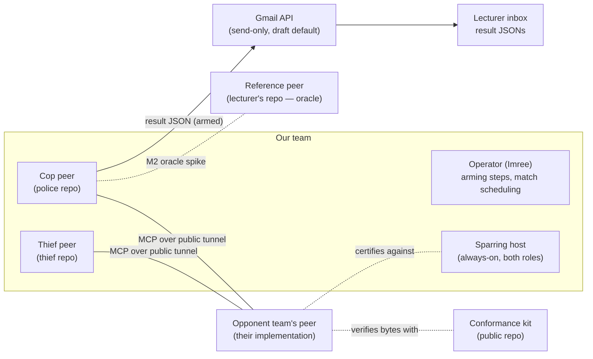
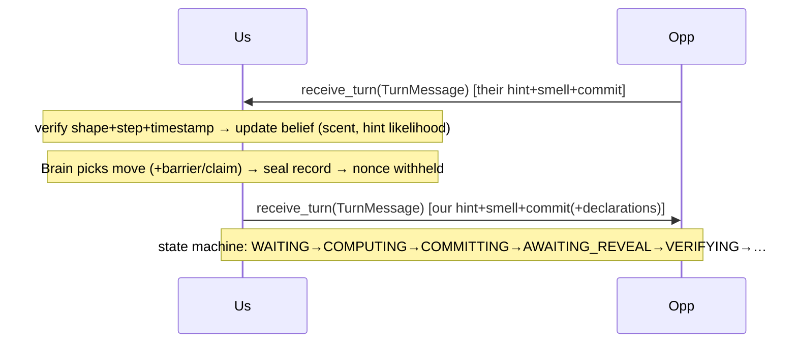

# PLAN — Cops-and-Robbers P2P Race

> **Status: APPROVED (Phase 2 gate, 2026-07-16), after cross-model review.** **This copy: the thief repo.**
> Architecture doc per guidelines §2.2: C4 views, flows, contracts, schemas, ADR index, milestone
> exit criteria. Values shown as binding `game.json` keys; nothing quantitative hardcoded.

## 1. System context (C4 level 1)



Trust model: the opponent is untrusted (verified cryptographically); Gmail is a quota-managed
external resource (gatekeeper-protected); the kit and sparring host carry zero private strategy.

## 2. Containers & deployment (C4 level 2)

Per role, one **peer process** (mandated separation): FastMCP server (inbound tools) + client
(outbound calls) + runtime + GUI window, plus a **watchdog thread** and inbox queues (threads only
at these seams; locks/queues per guidelines §15). Counted matches: operator machine, one process
per role actually playing, named tunnel (Cloudflare named / ngrok reserved — OI-3) exposing the
local port. Sparring: small always-on host running cop + thief peers with the generic brain,
`email.mode` hard-pinned to `draft`. CI (both repos): keyless, mock LLM, in-process MCP fake.

## 3. Packages & dependency rules (C4 level 3 — approved layering)

```
copthief_core/
  domain/    board, rules, scoring, scent, belief, crypto, terms, state machine   [no I/O]
  wire/      TurnMessage / AuditPayload / ControlMessage (+validation)            [depends: nothing]
  strategy/  BrainBase seam, features, baseline brains                            [depends: domain]
  peer/      orchestrator, handshake, sealing, turn loop, audit, deadline, watchdog
             [depends: domain, wire, strategy, infra interfaces]
  infra/     mcp server/client, tunnel helper, gmail sender, llm providers        [adapters only]
  report/    artifact schemas, canonical emitter, email gatekeeper                [depends: domain]
  gui/       live view, replay verifier, belief-vs-truth overlay                  [depends: domain, report]
  sdk/       SimulationSdk facade — THE single business entry point (guidelines §4)
  shared/    config loader (+App F guard), rate limiter, sysinfo, version, constants
copthief_police/ | copthief_thief/   role brain + config tree                     [role repos only]
```

Hard rules: `domain` is pure (no network/files/clock); every consumer (CLI, GUI, arena, sparring,
series runner) goes through `sdk`; `infra` adapters are swappable (mock LLM, in-process MCP fake
implement the same interfaces); one rules module serves **referee mode** (full info: tests, arena,
tuning) and **peer mode** (hidden positions: live play).

## 4. Runtime flows (key sequences)

**Handshake (pre-game gate):**
`negotiate` carries proposal → App F guard validates statuses (fixed/minimum/negotiable) →
byte-identical `game.json` fixed → both sides sign (`SHA256(canonical(terms)|nonce)`) → verify
opponent signature → derive `game_uid` → exchange step-0 declarations (hardware, model, token cap,
**commit hash**, game-count declaration) → locked scent-model exchange (formula + numeric example,
hashed) → first mover per config. Any mismatch → refuse to start (loud, logged).

**Turn cycle (per step):**

Every outbound request carries a deadline (`response_timeout_sec`); overdue → bounded retry →
technical-loss handling, never infinite wait.

**End-of-game audit:** exchange `submit_audit(AuditPayload)` (full sealed records + nonces +
result claim) → re-hash every opponent record with OUR serializer → any mismatch = tamper (0/0
per rules) → **scent-physics check** (re-derive their expected trail from revealed moves + locked
model; diff vs the grids they transmitted; evidence-grade log) → agree result → profiling extracts
opponent lie-rate/motion stats for next mini-game.

**Reporting (per legal game):** build 4 artifacts named by `game_uid` → result JSON canonical
bytes = emailed bytes → gatekeeper (quota → token bucket → DoS detector) → **draft mode unless
operator armed the counted series** → both teams send separately.

## 5. Game state machine (per mini-game, both roles symmetric)

| From | To | Trigger |
|---|---|---|
| WAITING_FOR_OPPONENT | COMPUTING_MOVE | valid TurnMessage accepted |
| COMPUTING_MOVE | COMMITTING | brain returned legal action |
| COMMITTING | AWAITING_REVEAL | our TurnMessage sent |
| AWAITING_REVEAL | VERIFYING | opponent message / ack received |
| VERIFYING | WAITING_FOR_OPPONENT | checks pass, game continues |
| VERIFYING | GAME_OVER | capture / survival / claim resolution |
| any comm state | TECHNICAL_LOSS | deadline exhausted / illegal transition / protocol violation |

Illegal transition ⇒ raise immediately (bug surfaces in dev, not as silent freeze). Terminal
states: GAME_OVER (→ audit), TECHNICAL_LOSS (→ controlled shutdown + state persistence).

## 6. Wire contract (interface-mirror of the reference; kit page will publish it)

Tools (all take/return dicts): `negotiate(message)` · `receive_turn(message)` ·
`submit_audit(payload)` · `receive_control(message)` (opt-in status/restart/quit; never sealed).
`TurnMessage`: step, sender, hint, smell_grid `{"r,c": v}`, commit, timestamp, barrier_placed?,
capture_claim?, claim_response?, win_claim?. `AuditPayload`: sender, records
`[{payload, nonce, commit}]`, result_claim. Sealed record (self-consistent, richer than the wire):
state string, move, verdict/intent, hint, step, sub_game, role (+timing/tokens). Schema validation
on every inbound message before any state change; unknown fields tolerated (forward-compat),
missing required fields → reject.

## 7. Config & data schemas

- `config/game.json` (signed, byte-identical): sections `board_and_agents`, `world`,
  `movement_and_barriers`, `scoring`, `pheromones`, `network_and_league`,
  `rate_limiter_gatekeeper` — exactly the App B schema; loader enforces App F statuses + defaults.
- `config/game.toml` (private): group identity, ports, opponent URL, `[strategy]`
  thief_class/police_class, `[trash_talk]` provider, `[llm]`, `[email]` recipient+mode.
  JSON overlays TOML on shared keys.
- `config/rate_limits.json` (private, versioned): operational limits ≥ signed minimums (loader
  asserts precedence).
- Artifacts: `declaration_<game_id>.json`, `config_<game_id>_g<NN>.json`, `log_<game_id>_g<NN>.json`,
  `result_<game_id>.json` (schemas in `report/artifact_schemas`, validated before write/send).
- JSONL runtime log: one record per event (sent/received verbatim bytes, state transitions,
  belief snapshots, decisions + provenance) — feeds replay, overlay, profiling, disputes.

## 8. Strategy subsystem

`BeliefFilter` (domain): P(opponent cell) over the grid; predict step = motion model constrained
by declared barriers; update step = scent-grid likelihood (locked model semantics; SQ1 pins timing)
× hint likelihood (gazetteer → implied cells, weighted by per-opponent trust). `BrainBase` seam:
`_pick_move(observation, belief) → action` (+ cop `_decide_move` barrier/claim). Shipped brains:
baselines (random, greedy-Manhattan) in core; `PoliceBrain` (shallow expectimax over belief;
barrier = graph surgery on thief's reachable component; claim policy thresholded on belief mass);
`ThiefBrain` (region-survival: maximize safe reachable area vs cop belief-mode; deception timing).
Feature weights from `config`; tuned offline by `genetic/` self-play in referee mode; **arena**
(sdk consumer): seeded round-robin, win/points tables, champion regression gate in CI, sensitivity
sweeps → `notebooks/results_analysis.ipynb`.

## 9. GUI & replay

Live (per peer, local truth only): belief heatmap, own position/barriers, turn banner
(YOUR TURN / LOCKED), never the objective board (App E rules 8–9). Replay verifier: load log →
re-verify each record (recompute commit from revealed payload+nonce) → Verified OK / TAMPERED
banner; **post-audit overlay**: opponent true trajectory over our belief history + belief-error
curve export (PNG for README).

## 10. Reliability & chaos

DeadlineTracker wraps every outbound call; Watchdog thread monitors loop heartbeat
(`watchdog_timeout_sec`) → persist state + controlled shutdown. Chaos harness (tests/chaos/,
sdk-driven): kill tunnel mid-commit · delay to deadline edge · malformed/duplicate/replayed
TurnMessage · oversized hint · audit with tampered record. Each drill asserts the specific
defense fires; logs committed as README evidence.

## 11. Sync-core mechanism (ADR-0001)

`scripts/sync_core.py` (police=lead → thief): refuses if sibling has uncommitted changes in
mirrored paths; copies `copthief_core/`, `.claude/skills/`, workflows, REVIEW_PROCESS.md; writes
`sync_manifest.json` (SHA-256 per file + tree hash + source commit); sibling commit message
`sync: core from police@<sha>`. CI in both repos recomputes the manifest → mismatch = red.
Role packages, configs, READMEs, docs/ excluded from the mirror.

## 12. Testing strategy (keyless CI)

Tier 1 unit: domain/wire/report per TDD, ≥90% on deterministic core; kit CORE vectors as fixtures
(canonical/commit/terms/game_uid/pheromone). Tier 2 integration: full mini-game + series over
in-process MCP fake with mock LLM; state-machine property tests; App F guard cases; gatekeeper
under synthetic load (queue, never crash). Tier 3 committed evidence (off-CI): M2 oracle-spike
logs, chaos-drill logs, friendly cross-audit logs, arena/tuning outputs. CI also runs ruff,
mypy --strict, coverage fail_under, 150-line check, no-hardcoded scan, secret scan, sync manifest.

## 13. Milestone exit criteria (binary, observed end-to-end)

| M | Exit criterion (all must be observed, not intended) |
|---|---|
| M0 | Both repos: CI green on empty `src/`; sync round-trip demonstrated (core edit in police → sync → thief green; induced drift → thief CI red) |
| M1 | One command runs a full localhost mini-game between two processes with sealing + self-audit pass; kit CORE vectors green in both CIs |
| M2 🚦 | Vs reference peer, two machines, named tunnels: negotiate locks terms, full mini-game, mutual audit Verified OK both directions; SQ1–SQ3 answered in writing; tunnel ADR noted |
| M3 | Arena runs seeded series headless with baselines; belief filter beats last-known-position tracking on belief-error in referee sims; our hints round-trip our own parser |
| M4 | Live GUI screenshot captured during a real game; replay shows Verified OK on an M2 log and TAMPERED on a mutated one; overlay renders error curve |
| M5 | Both brains ≥60% arena win-rate vs reference heuristic; genetic run yields improving fitness curve artifact; profiling shifts mini-game-2 priors in a test series |
| M6 | Full series (`num_games`) vs sparring/local produces 4 valid artifacts; report lands as Gmail **draft**; gatekeeper limits proven by test; step-0 carries real commit hash |
| M7 | Sparring host up (external reachability check); kit contract page + audit fixture + **pre-match checklist & netcheck script** (HW6 `netcheck.py` salvage: reach tunnel / `negotiate` answers / auth ok — runnable by any pair) published, CI green; ≥1 external friendly with clean cross-audit; first counted series completed |
| M8 | `check_submission.py` green in both repos; tags pushed; README sections + screenshots complete; self-grade script output == SELF_GRADE.md |

## 14. ADR index

docs/adr/: 0001 sync-mirror topology · 0002 reference-reuse posture (EULA) · 0003 crypto-early
build-order deviation · 0004 scent-model form (kit-pinned vs book prose) · 0005 strategy track
(belief+search, no-RL foundation) · 0006 deploy split + tunnel choice · 0007 zero-token verbal
layer + injection defense. Written when the decision lands; format Context/Decision/Status/
Consequences/Alternatives.
